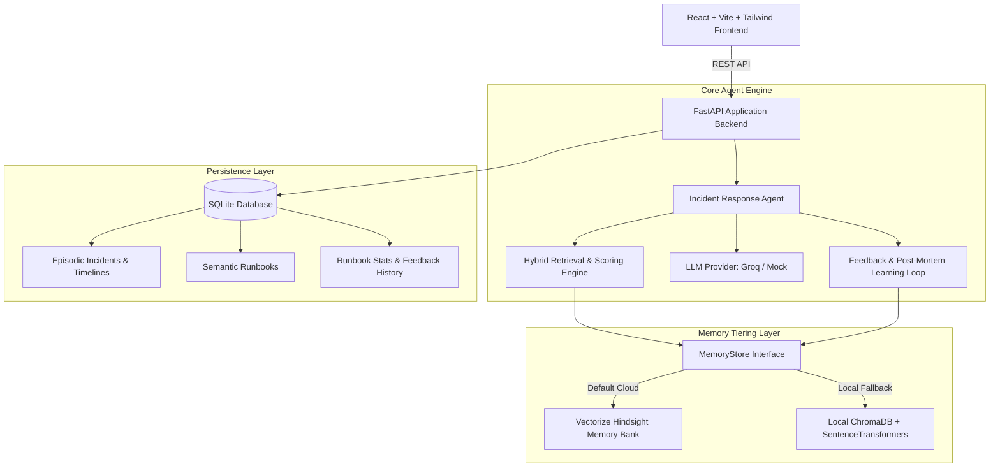

# Incident Response Agent with Persistent Memory

An autonomous Site Reliability Engineering (SRE) copilot designed to dramatically shorten Mean Time to Recovery (MTTR) during production outages. 

Traditional triage suffers from organizational amnesia: on-call engineers spend precious downtime rediscovering root causes, repeating manual commands, or attempting unverified workarounds. This agent maintains persistent **Episodic**, **Semantic**, and **Effectiveness** memory powered by **Vectorize Hindsight** (with local ChromaDB fallback) and **Groq Llama-3.3-70b** (with mock fallback).

---

## 1. System Architecture



---

## 2. Memory Architecture

The agent implements a three-tier memory model:

1. **Episodic Memory**: Detailed records of historical incidents:
   - Metadata: `id`, `title`, `service`, `severity`, `status`, `symptoms`, `logs_snippet`, `timeline`, `root_cause`, `resolution_steps`, `runbook_id`, `time_to_resolve_min`, `outcome`.
   - Stored in both SQLite and indexed in the persistent memory bank.

2. **Semantic Memory**:
   - **Operational Runbooks**: Step-by-step Standard Operating Procedures (SOPs) with prerequisites and mitigation checklists.
   - **Post-Mortem Lessons**: Structured root-cause analysis (RCA) takeaways and preventative action items extracted from post-mortem documents.

3. **Effectiveness Memory**:
   - Empirical runbook performance tracked continuously: `times_suggested`, `times_worked`, `success_rate`, and `avg_mttr_min`.
   - Updated dynamically on operator feedback (thumbs up / thumbs down) and incident resolution.

### Hybrid Retrieval & Scoring Formula
Candidate incidents are retrieved from memory and evaluated using a weighted multi-factor scoring formula:

$$\text{Score} = 0.40 \cdot \text{Sim}_{\text{vector}} + 0.20 \cdot \text{Match}_{\text{service}} + 0.15 \cdot \text{Match}_{\text{severity}} + 0.15 \cdot \text{SuccessRate}_{\text{runbook}} + 0.10 \cdot \text{Decay}_{\text{recency}}$$

Every recommendation presents an **explainable score breakdown** so on-call operators understand exactly why a past incident was cited.


---

## 3. Technology Stack

- **Backend**: Python 3.12+, FastAPI, Pydantic v2, SQLAlchemy 2.0 + SQLite
- **LLM Reasoning**: Pluggable provider layer:
  - Groq Cloud (`llama-3.3-70b-versatile` / `openai/gpt-oss-120b` / `qwen/qwen3.8-27b`)
  - Automatic fallback to high-fidelity deterministic `MockLLMProvider`
- **Memory Layer**:
  - Vectorize Hindsight via official `hindsight-client` Python SDK
  - Automatic graceful fallback to local `chromadb` + `sentence-transformers`
- **Frontend**: React 19, Vite, Tailwind CSS, Recharts, Lucide Icons
- **Testing**: `pytest`, `pytest-asyncio`, `httpx`
- **Containerization**: Docker, Docker Compose (`env_file: .env`)

---

## 4. Setup & Running Locally

### Prerequisites
- Python 3.11+
- Node.js 18+ and npm
- (Optional) Docker and Docker Compose

### 1. Environment Configuration
Create a `.env` file in the root directory (never commit this file):
```bash
cp .env.example .env
```

Ensure `.env` contains:
```env
LLM_PROVIDER=groq
GROQ_API_KEY=gsk_****
GROQ_MODEL=llama-3.3-70b-versatile
MEMORY_BACKEND=hindsight
HINDSIGHT_API_KEY=hsk_****
HINDSIGHT_BASE_URL=https://api.hindsight.vectorize.io
HINDSIGHT_BANK_ID=incident-response-bank
```

### 2. Install Dependencies & Seed
```bash
# Python Virtual Environment
python3 -m venv venv
./venv/bin/pip install -r requirements.txt

# Frontend Dependencies
cd frontend && npm install && cd ..

# Seed 26 realistic incidents, 10 runbooks, and 5 post-mortems into Hindsight & SQLite
make seed
# Or: ./venv/bin/python3 data/seed_data.py
```

### 3. Run Development Servers
```bash
make dev
```
- **Backend API**: `http://localhost:8000` (Swagger docs at `http://localhost:8000/docs`)
- **Frontend App**: `http://localhost:5173`

### 4. Running with Docker Compose
```bash
docker-compose up --build
```

### 5. Running Tests
```bash
make test
# Or: ./venv/bin/pytest -v
```

---

## 5. End-to-End Demo Walkthrough

### Scenario: "DB connection timeouts after deploy"
1. **Open Frontend**: Navigate to `http://localhost:5173`.
2. **Select Active Incident**: Choose `INC-1026: Production payment gateway timeout on checkout` or click **"Report Incident"** and click **"⚡ Load Demo Scenario Preset"**.
3. **One-Click Triage**: Click **"Analyze Incident with Memory"**.
4. **Inspect Recommendations**:
   - The agent consults Hindsight memory and retrieves historical incident `INC-1001` (*"DB connection timeouts on payment-service after checkout deploy"*).
   - Identifies the probable root cause: Connection pool exhaustion from unclosed database handles.
   - Confidence score: **~92%**.
   - Explicitly cites past incident ID: `INC-1001`.
   - Recommends verified runbook: `RB-001: Postgres Connection Pool Saturation Recovery` (93% historical success rate).
   - Generates an actionable resolution checklist.
5. **Submit Operator Feedback**:
   - Click **"Thumbs Up (Helpful)"**.
   - Watch the runbook effectiveness stats update in real-time.
6. **Resolve Incident**:
   - Click **"Resolve Incident"**, confirm MTTR (e.g. 15 minutes), and submit.
   - The resolved incident is immediately retained into episodic memory for future retrieval.
7. **Inspect Memory & Analytics**:
   - Visit the **Memory Explorer** tab and query `"connection pool timeouts"` to see the raw indexed vectors and graph nodes in Hindsight.
   - Visit the **Analytics & MTTR** tab to view MTTR improvement curves over time.

---

## 6. API Reference

| Method | Endpoint | Description |
|---|---|---|
| `GET` | `/health` | Service health, active components, masked keys |
| `POST` | `/incidents` | Create a new incident in `OPEN` state |
| `GET` | `/incidents` | List incidents with filters (`service`, `severity`, `status`) |
| `GET` | `/incidents/{id}` | Get full incident details |
| `POST` | `/incidents/{id}/analyze` | Trigger agent memory recall and LLM root cause analysis |
| `POST` | `/incidents/{id}/feedback` | Record operator thumbs up/down and update runbook weights |
| `POST` | `/incidents/{id}/resolve` | Mark incident resolved, update MTTR, and retain in memory |
| `GET` | `/runbooks` | List runbooks with empirical success rates |
| `POST` | `/runbooks` | Register a new runbook and index into memory |
| `POST` | `/postmortems` | Ingest and parse post-mortem markdown into structured lessons |
| `GET` | `/memory/search?q=` | Query persistent memory bank directly |
| `GET` | `/analytics` | MTTR trends, root cause frequencies, repeat incident rate |

📺 Project Demo Video
Watch the complete 3-minute architectural walkthrough and live incident triage demonstration:

YouTube Demo: SRE Memory Triage Walkthrough

📖 Deep-Dive Technical Articles
Each engineering team member authored an in-depth technical analysis covering distinct architectural aspects of the project:
Member	Focus Area	Technical Article
Hasini Borigi	Production Incident Debugging & Real-world Outages	How I Debugged 3 AM Postgres Pool Outages With Hindsight
Thanmai Etamsetti	3-Tier Agent Memory Architecture & Hybrid Scoring	Designing a 3-Tier Agent Memory Engine Using Hindsight
Pardha Saradhi Thota	Empirical Benchmark: Stateless LLMs vs. Stateful Agents	Why I Stopped Using Stateless LLMs for Production Outages
Sai Charan Duvvi	End-to-End FastAPI & Groq Implementation Lifecycle	How I Built an Incident Response Agent With Hindsight
Divya Chikkudu	Anti-Vector RAG & Runbook Efficacy Learning Loops	Why Vector RAG Fails for Incident Triage Without Hindsight
Balaji Mallik	High-Availability, Circuit Breakers & Fallback Resilience	How I Designed Fallback Resilience Into Our Hindsight Agent

🌐 Community & Discussions
Reddit Discussion: r/AI_Agents Technical Showcase

LinkedIn Project Insights
Member 1 (Hasini): View LinkedIn Post

Member 2 (Thanmai): View LinkedIn Post

Member 3 (Pardha): View LinkedIn Post

Member 4 (Sai Charan): View LinkedIn Post

Member 5 (Divya): View LinkedIn Post

🔗 Reference Links
Hindsight GitHub Repository: vectorize-io/hindsight

Hindsight Documentation: hindsight.vectorize.io

Understanding Agent Memory: What is Agent Memory?

📄 License
This project is licensed under the MIT License.
